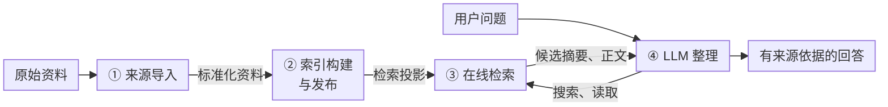
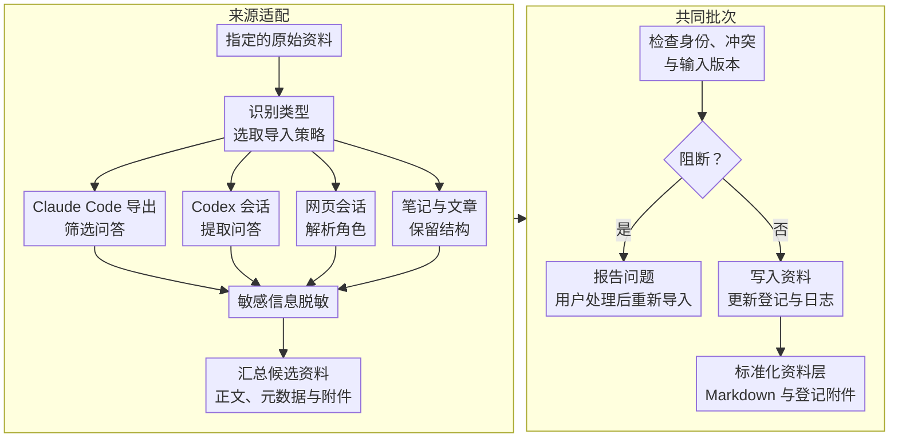
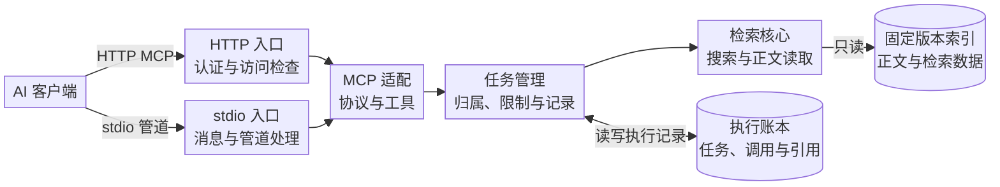
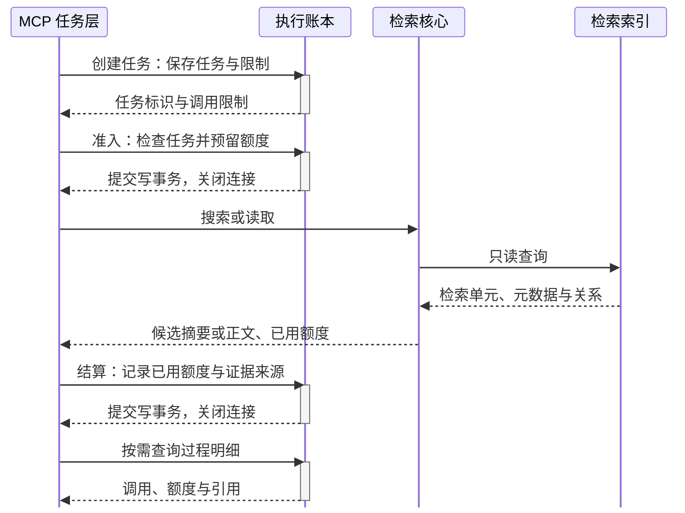
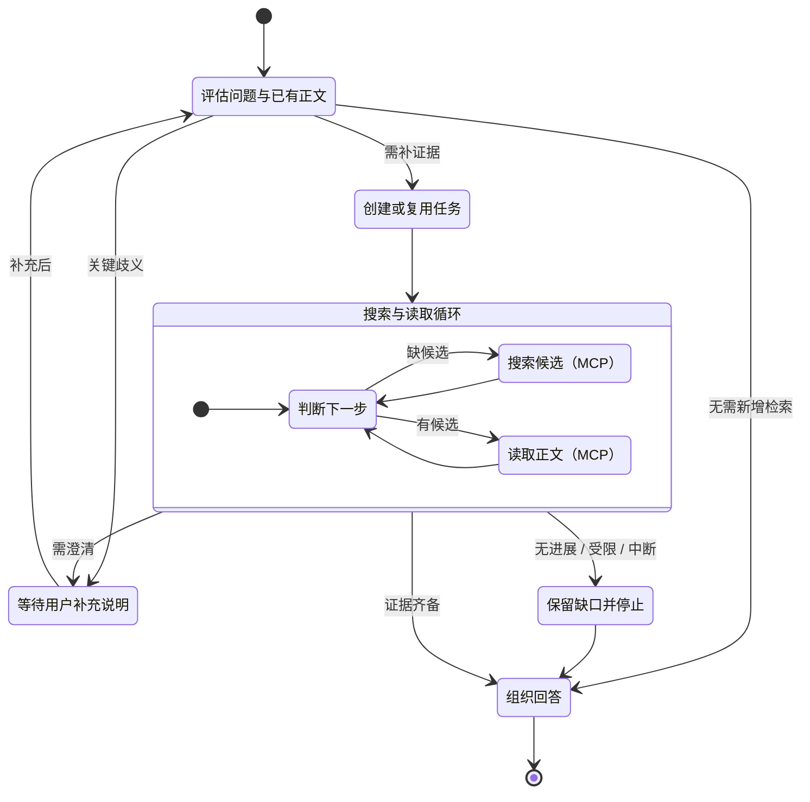

# 架构与关键设计

Learn Corpus 将资料接收、索引构建、在线检索和 AI 回答分开。本文描述当前代码的职责和数据流；模块及命令索引见[源码说明](../src/README.md)，字段与运行配置见[配置说明](../config/README.md)。

## 整体流程

项目分为四个阶段：来源导入、索引构建与发布、在线检索、AI 回答。前两个阶段准备资料，后两个阶段围绕用户问题使用资料：先搜索候选摘要，再按需读取正文，并根据证据缺口继续搜索或读取。



图中的资料流向对应三层数据，按用途区分，而不是按存放目录划分：

| 数据层 | 内容与职责 | 说明 |
|---|---|---|
| 原始资料 | 会话导出、笔记、文章及关联资源，是原始输入 | 只读导入 |
| 标准化资料 | 按来源规则筛选、整理后的正文、结构与来源标识 | 由导入与维护组件管理 |
| 检索投影 | 从标准化资料生成的正文切片、定位信息、关联关系和词法索引，证据更新后重建 | 离线构建，在线检索 |

检索单元（item）是索引中可独立搜索和读取的内容单位，包含正文、来源信息和关联关系。

**搜索返回候选摘要**：从命中的检索单元正文中截取命中片段（`snippet`），附带来源定位与关联关系，供 LLM 判断哪些内容值得读取。**读取返回正文**：按所选检索单元及关联上下文返回正文，供 LLM 判断证据并组织回答。

搜索与读取是两个独立操作，均由检索服务执行，服务端不调用模型生成答案。后文依次展开[来源导入](#来源导入流程)、[索引构建](#检索索引构建)、[搜索与上下文读取](#搜索与上下文读取)，并说明[服务结构](#服务结构与接口分工)、[数据库访问](#数据库访问) 和 [检索循环](#检索循环与停止条件)。

来源登记、输入分析、审核处置和变更记录用于管理资料的标准化；MCP 执行账本记录在线任务、调用、预算与引用定位，不保存证据正文或模型推理。这些管理信息围绕主数据流工作，不单独构成正文的数据层。具体文件范围、程序维护边界与审核处置输入的例外见[产物维护边界](usage.md#产物维护边界)。

## 来源导入流程

导入先按来源类型分别解析和整理，在准备候选内容时进行脱敏，再汇入共同批次完成校验与写入。各类输入最终都以 Markdown 文档进入标准化资料层，保留各自的内容结构与来源信息。



图中的四条分支是来源适配，各自负责以下处理：

| 来源类型 | 导入时的主要处理 |
|---|---|
| Claude Code 二级导出 | 解析已导出文件的会话与角色，选取用户内容和助手最终回答，省略工具、推理及过程内容，记录省略计数 |
| Codex rollout | 解析 JSONL 中的事件与角色，保留用户内容和助手最终回答；fork 会话校验父子关系与共同前缀，仅保留分叉后的增量 |
| 网页会话导出 | 解析浏览器插件导出的 ChatGPT / DeepSeek Markdown，整理问答配对、来源身份及定位，检查本地图片、附件和引用问题，并整理资源引用 |
| 笔记与文章 | 保留 Markdown 章节、代码块与链接，读取原有元数据，检查并整理支持的本地附件；文章另登记发布来源、作者等信息和外部来源角色 |

各分支先准备候选资料与写入计划，**正式写入时交给共同批次层**。提交前检查来源身份、目标冲突和输入版本是否一致，并更新本批输入分析（inventory，记录输入的分析结果）与审核队列（review queue，列出待处理问题）。检查涉及原始文件、附件及来源登记表，准备后发生变化时需要重新准备。被规则正常排除的输入不等于阻断问题。

图中的**写入资料、更新登记与日志**包括：写入 Markdown 文档和登记附件，保存来源登记表（manifest，记录资料身份、路径、hash 与处理状态），追加变更日志（ingest log，记录实际的来源文件变动）。图中合并展示，实际仍按这一顺序执行。

**标准化资料的正文统一保存为带 YAML front matter 的 Markdown 文件**，即在文件开头用 YAML 元数据块登记来源 ID、类型、原始路径、内容 hash、locator（原始内容的定位标记）和导入器版本。会话正文保留问答及角色结构，笔记和文章正文保留章节结构。图片和附件按来源规则另存并登记，正文中的资源引用指向相应位置。后续构建读取统一的文档与登记信息，再按会话或文档结构生成检索投影。

存在阻断问题时，正式调用可以更新辅助状态文件，但整批不提交新来源，保留已有正式来源。用按来源规则确认审核处置、补齐输入或调整导入范围后，重新调用导入入口；程序从准备与解析开始重新执行检查，本批无阻断问题后才进入正式写入。需要用户确认的审核处置及填写方式见[产物维护边界](usage.md#产物维护边界)。

来源和维护流程使用 `LEARN_CORPUS_DATA_ROOT` 指定的数据工作目录定位 `sources/`、`meta/`；未设置时保持代码仓库根目录的原有默认布局。代码与数据可分别管理，见[工作目录与仓库关系](workspaces.md)。服务的索引路径仍由 `corpus_path` 配置。

> 输入或附件在准备后变化时，快照检查阻止提交，需要重新准备。`dry-run` 是可选的预览方式，不写辅助状态或正式产物。<br>
> 会话标准化经过内容筛选，不能从标准化资料还原所有原始事件；Claude 和网页会话的识别还受已有导出格式与可见内容限制。

实现依据：[Claude 导入](../src/ingestion/import_claude.py)、[Codex 导入](../src/ingestion/import_codex.py)、[网页会话导入](../src/ingestion/import_web_chat.py)、[笔记与文章导入](../src/ingestion/import_markdown.py)、[脱敏规则](../src/ingestion/common.py)、[共同批次](../src/ingestion/batch.py)、[Markdown 文档结构](../src/corpus/document.py)、[来源存储](../src/corpus/storage.py)、[变更日志](../src/corpus/ingest_log.py)。

## 检索索引构建

构建只接受 manifest 中 `ready`（可参与投影）的来源，并核对来源文件、登记关系和内容。投影产生确定性的检索单元。会话按 exchange（一组用户内容与助手最终回答）、发言角色和 part（长内容分片）组织；笔记和文章按章节与 part 组织。分片保留 Markdown 结构，同时登记同一逻辑单元的相邻片段和问答对应关系。

一个索引目录包含：

```text
meta/corpus/
├── idx_<digest>/
│   ├── index.json       # 索引摘要、构建信息和策略版本
│   └── corpus.sqlite    # 检索单元正文、元数据、关系与 FTS5
├── current              # 当前发布索引的符号链接
└── previous             # 发布时保留的上一索引，可不存在
```

`index_id` 来自投影摘要。同样的投影可以复用已验证的产物；新产物在暂存目录构建并校验后安装，不原地改写正在使用的索引。构建与发布分别执行：发布切换 `current`，原来的 `current` 保留为 `previous`。

服务启动时只解析一次 `current`，验证索引后以 immutable SQLite 连接固定其真实目录，保证一次运行读取一致的版本。后续链接变化不会影响已运行进程；切换与旧版本保留的操作见[配置说明](../config/README.md#服务重启客户端重连与旧索引保留)。

导入与索引构建可以在本机或独立构建环境完成，再将检索索引发布到部署机。在线服务直接从 `corpus.sqlite` 读取正文、元数据和关系，部署机无需保存原始输入、`sources/`、来源附件或 `meta/manifest.json`。返回的来源 path 与 locator 用于标识出处，不要求部署机存在对应来源文件；来源维护与重新构建仍在持有资料的环境中完成。

检索索引包含已收录的资料正文与来源元数据，仍属于需要保护的数据；不部署来源文件不等于部署机没有资料内容。部署机可以只安装运行所需代码、依赖、配置和索引，所需代码目录及部署条件见[部署代码说明](../config/README.md#检索部署所需的代码目录)。

实现依据：[检索单元投影](../src/retrieval/project_items.py)、[索引构建与发布](../src/retrieval/build_lexical_index.py)、[产物验证](../src/retrieval/index_artifact.py)、[固定索引读取](../src/retrieval/lexical_store.py)。

## 搜索与上下文读取

搜索接收词法 anchors，即用于匹配的词或标识。单条 query 内按 AND 组合；同一意图的语言、缩写等变体可以作为多条 query。每条分别用 SQLite FTS5 与 BM25 计算相关性，再以等权 RRF 按排名融合结果，返回带摘要的候选。

AI 根据摘要选择 seed（本次读取的中心检索单元），然后调用 `read_bundle`。bundle 是同一 exchange 或直接章节下的关联检索单元集合，读取过程如下：

1. 校验成员和关系，确认属于同一逻辑单元。
2. 完整返回 seed，在预算内按距离扩展附近正文。
3. 按来源顺序输出实际取得的检索单元，并列出因预算未返回的成员。

成功的预算部分响应标记为 `partial_budget`。若连完整 seed 与必要元数据都无法容纳，则返回 `budget_exceeded`；损坏关系或存储错误整体失败。`complete` 说明本次 bundle 已完整，不说明整个问题或资料库已经穷尽。

搜索摘要用于选候选，已读正文才支持事实判断。检索单元的来源元数据说明出处，locator 定位具体位置。证据角色随检索单元保留：用户发言为 `user_statement`，助手回答为 `assistant_suggestion`，文章为 `external_source`；普通笔记通常没有这三类角色标记。

实现依据：[query 编译](../src/retrieval/lexical_query.py)、[BM25 与 RRF](../src/retrieval/lexical_store.py)、[bundle 成员关系](../src/retrieval/bundle.py)、[检索响应与预算](../src/retrieval/public_core.py)。

## 服务结构与接口分工

MCP 是 AI 使用检索工具的主要入口，REST 用于辅助检查、调试与验证。本节说明服务入口和模块分工；搜索算法、数据库操作与 AI 的证据判断分别在对应章节展开。

### MCP 主服务结构



图展示 MCP 的主调用链，箭头表示请求调用与数据访问。HTTP 和 stdio 两种入口汇入共享的协议适配、任务管理和检索核心代码；各进程分别创建服务实例。统一启动入口通过 `mcp.transport` 互斥选择 `http` 或 `stdio`：HTTP 模式运行网络服务并同时提供 REST，stdio 模式由客户端启动子进程并管理管道。

协议适配负责 MCP 消息校验、工具分派和结果封装。任务管理层（`RetrievalTaskService`）负责任务归属、调用准入、限制和执行记录；检索核心（`RetrievalCore`）负责从固定索引搜索候选摘要、读取正文。执行账本与检索索引是两个独立数据库，具体读写和事务见[数据库访问](#数据库访问)。

MCP 提供五个工具，分别承担任务与资料访问职责：

| 工具 | 职责 |
|---|---|
| `start_retrieval_task` | 创建任务并返回固定的 limits |
| `search_sources` | 在任务内搜索候选摘要 |
| `read_bundle` | 读取同任务搜索命中的 seed 正文与关联上下文 |
| `get_retrieval_task` | 查询执行统计与引用定位元数据 |
| `status` | 检查索引能力与账本健康 |

两种 MCP 连接方式共享工具契约和任务逻辑。访问边界、协议版本、运行参数与客户端连接见[配置说明](../config/README.md#codex-http-mcp-连接)。

### REST 辅助接口

REST 支持直接检查和验证检索能力：`/v1/status` 查看索引信息，`/v1/search` 检查候选摘要，`/v1/read-bundle` 核对正文读取。请求经过 HTTP 入口后直接调用检索核心，按单次请求校验与限制，不创建检索任务或更新执行账本。

REST 与 MCP 复用同一搜索算法和正文读取实现；在同一 HTTP 进程中，两者还使用同一个固定索引实例。工具契约、调用约束与响应封装有所不同。MCP 在检索核心外增加任务管理，并配合检索 skill 和 AI 组成主要问答流程；回答如何使用证据见[检索循环与停止条件](#检索循环与停止条件)。

实现依据：[统一服务入口](../src/service/server.py)、[HTTP API](../src/service/http/api.py)、[HTTP MCP](../src/service/http/mcp.py)、[stdio 服务](../src/service/stdio/stdio_server.py)、[共享 MCP 协议](../src/service/mcp_protocol.py)。

## 数据库访问

**检索索引(Retrieval Index)** 数据库保存资料正文与检索数据：`items` 存放检索单元的正文、元数据和关系，`items_fts` 提供全文匹配。每个 `LexicalStore` 使用一个固定版本的常驻只读连接，以进程内 `RLock` 保护连接访问；打开方式为 `mode=ro&immutable=1`，并设置 `query_only=ON`。

**执行账本(Execution Ledger)** 数据库保存任务记录、调用记录、预算与引用定位，不保存证据正文。每次操作使用独立短连接；准入和结算以 `BEGIN IMMEDIATE` 开始写事务，由 SQLite 文件锁协调连接和进程，提交后关闭连接。

### 检索与任务查询的时序

下图展示创建任务（`start_retrieval_task`）、一次搜索或正文读取（`search_sources` / `read_bundle`），以及按需查询过程明细（`get_retrieval_task`）的成功路径。搜索和读取可重复调用；明细查询可在检索过程中或回答之后发起，并非每次检索的必经步骤。



创建、准入和结算各自使用 `BEGIN IMMEDIATE` 写事务，过程查询使用 `BEGIN` 读事务，成功时均以 `COMMIT` 结束并关闭连接。索引检索期间不持有账本写事务，也没有跨两个数据库的共同事务；查询过程明细只读取账本记录，不读取证据正文或扣除检索额度。

> 预算与额度是对证据长度的估算，它不表示模型的真实计费 token。

### 锁与事务

三类操作的并发读写约束如下，调用先后见上面的时序图：

| 操作 | 并发读写约束 |
|---|---|
| 搜索（`search_sources`） | 主查询、排名融合与候选字段读取共用一次 `RLock` |
| 正文读取（`read_bundle`） | seed、关联成员和完整成员 ID 分别持锁查询；关系遍历不持续占用连接锁 |
| 任务管理与过程查询（`start/get_retrieval_task`） | 各操作使用独立短连接，由 SQLite 文件锁协调并发 |

搜索与读取通过同一 `LexicalStore` 实例的连接锁 `RLock` 访问索引。摘要生成、字段解析、关系校验和响应预算处理均在锁外完成；正文读取先校验完整成员，再选择返回窗口。索引没有显式的跨查询事务，immutable 模式省去文件锁和变化检测，因此已发布索引不能原地修改，见 [SQLite URI 说明](https://www.sqlite.org/uri.html)。

任务记录由 MCP 任务层调用账本存储模块读写，检索核心不操作账本。写事务以 `BEGIN IMMEDIATE` 开始，同一时刻只有一个写事务；读事务以 `BEGIN` 开始，在一致快照内查询、解析明细并汇总统计，提交后才裁剪明细和编码响应。账本使用 `DELETE` 回滚日志，读事务可能使写入提交等待，锁等待受 `busy_timeout_ms` 限制，见 [SQLite 事务说明](https://www.sqlite.org/lang_transaction.html)和[文件锁说明](https://www.sqlite.org/lockingv3.html)。

准入提交后的 `pending` 保留预留额度，成功结算时以已用额度替换。进程中断或结算失败可能留下未解决记录，阻止同任务新调用；支出未知时仍占用预留额度。服务完成结算后才返回成功结果，账本记录不证明客户端已收到证据。

实现依据：[只读索引连接](../src/retrieval/index_artifact.py)、[连接锁与查询](../src/retrieval/lexical_store.py)、[正文读取与响应计量](../src/retrieval/public_core.py)、[逻辑成员与关系校验](../src/retrieval/bundle.py)、[任务编排](../src/service/retrieval_tasks.py)、[账本连接、事务与表结构](../src/service/execution_ledger_store.py)。

## 检索循环与停止条件

AI 依据检索 skill 判断是否进入检索、选择下一步并组织回答，MCP 工具执行搜索、正文读取与任务约束。下图用逻辑状态概括这一循环，证据判断状态由 AI 在当前上下文中维护。



**问题澄清：** 问题不清晰，或对象、时间、比较范围等歧义会实质改变答案时，先请用户补充说明，收到补充后重新评估。检索中发现关键歧义也可暂停澄清；同一目标沿用原任务及预算。

**进入循环：** 用户要求结合资料库，或回答需要核对个人历史、来源角色与定位时，先检查当前上下文中的已读正文。正文足够时直接回答；需要新增证据时，明确待核对事实并创建或复用对应任务。追问沿用原目标的任务，不能为了重置额度新建任务。

**循环推进：** AI 根据已读正文检查事实支持、来源角色、冲突和缺口。有相关且尚未尝试的候选时优先调用 `read_bundle`；缺少候选时才围绕缺口改写查询，调用 `search_sources`。搜索摘要只用于选候选，实际读到的正文才支持事实判断。每次工具结果返回后，重新判断证据与可用操作，按需继续搜索或读取。

图中的“证据齐备”包括必要事实已获支持，以及冲突双方已读、可以保留差异两种情况；其余停止条件如下：

| 停止原因 | 判断条件 |
|---|---|
| 无进展 | 已无合理的补充查询和有效待读候选；连续两次搜索没有新相关候选且没有有效待读候选时停止 |
| 受限 | 补足缺口所需的操作均不可用，或额度不足以支持有意义的读取；搜索次数用完时，有读取额度和有效候选仍可继续读取 |
| 中断 | 任务阻断、认证或执行错误，或用户要求停止 |

停止后依据仍可核查的正文回答，保留缺口并记录停止原因；额度耗尽或服务错误不能改写为“没有证据”或“事实不存在”。结束本轮检索后，账本保留任务与调用记录，后续追问仍按任务复用规则处理。

**服务约束：** MCP 在首次成功搜索后固定索引版本，强制调用次数、累计证据预算与查询/读取去重，读取目标须来自同任务的搜索候选。服务端账本记录执行事实，AI 判断证据是否充分及是否值得继续；账本元数据不能代替正文，也不能保证上下文压缩后的证据恢复。预算与协议边界见[配置说明](../config/README.md#mcp-任务与执行账本)，内部调用时序见[数据库访问](#数据库访问)。

实现依据：[检索 skill](../.agents/skills/learn-corpus-retrieval/SKILL.md)、[聚焦检索策略](../.agents/skills/learn-corpus-retrieval/references/focused.md)、[探索检索策略](../.agents/skills/learn-corpus-retrieval/references/exploratory.md)、[任务执行与结算](../src/service/retrieval_tasks.py)、[持久化执行账本](../src/service/execution_ledger_store.py)。

## 架构文档维护

这些图按当前模块与调用关系绘制。相关代码发生变化时，同步更新对应图、解释和实现链接；新增方案在实现前应明确其状态，不能把规划中的能力画成已实现。

术语在相关章节首次出现时解释。首次使用与导入恢复见[使用指南](usage.md)，服务异常见[运行问题排查](../config/README.md#运行问题排查)。
